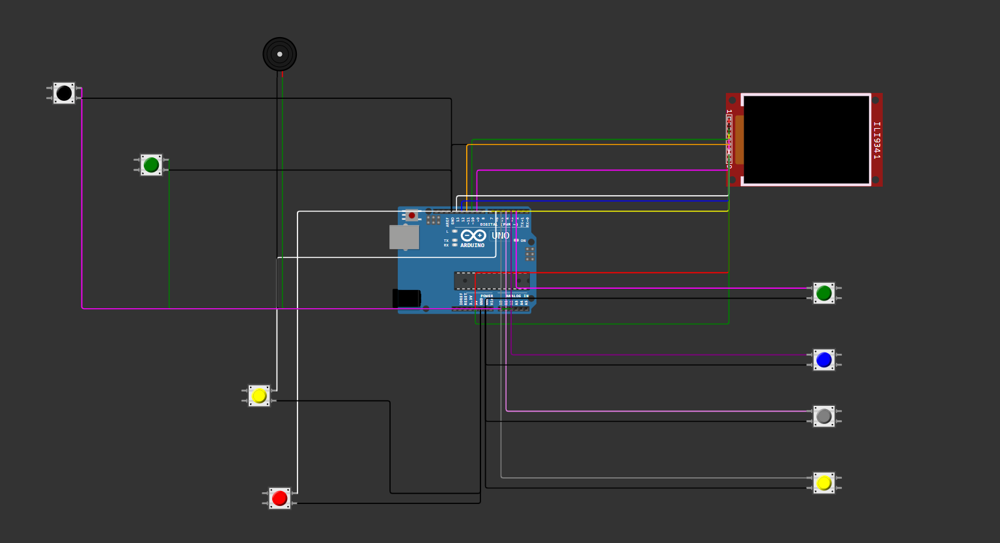
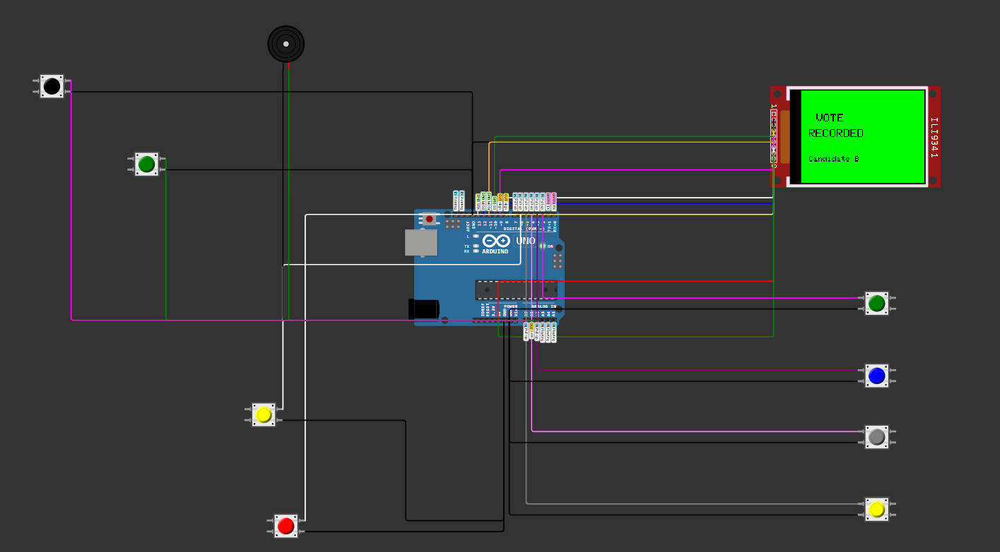
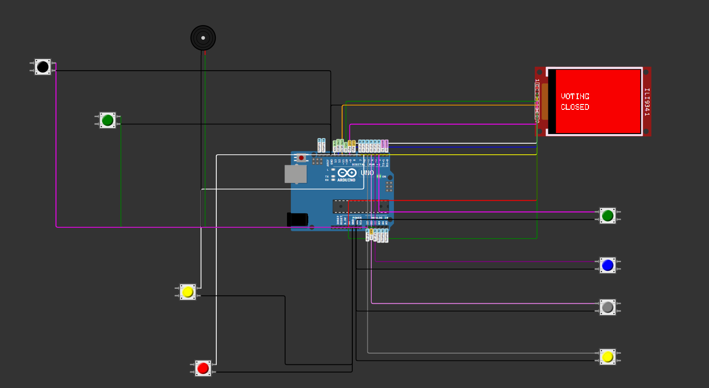
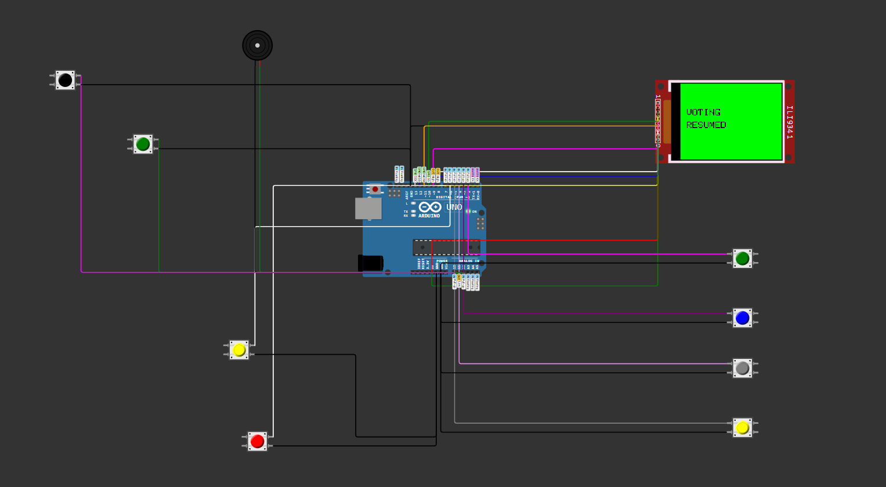
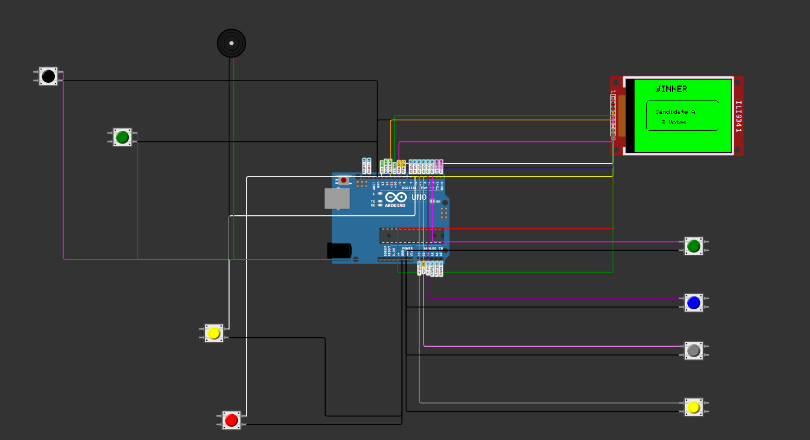
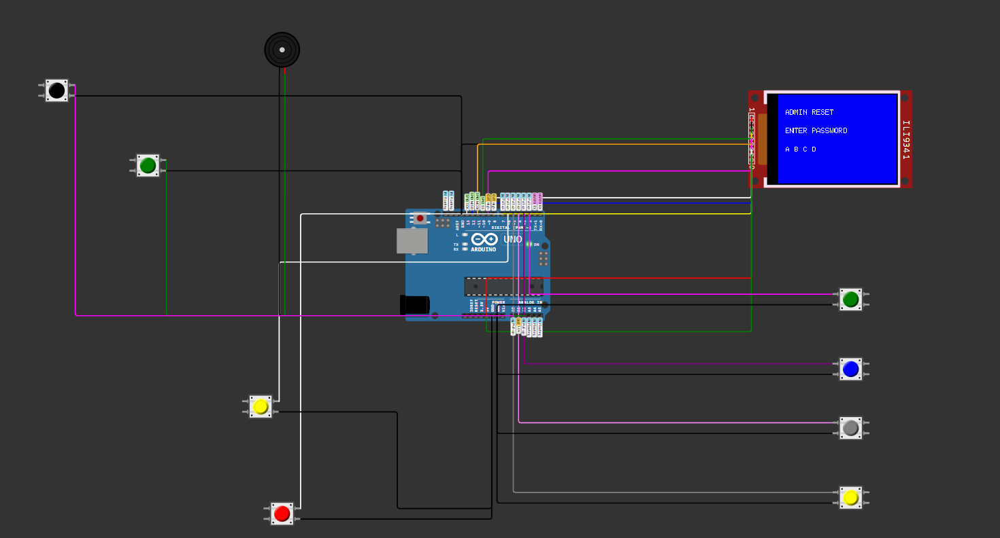

# Smart-Voting-System-Arduino
Arduino-based Smart Voting System with TFT Display, Password Protection, Vote Locking, Winner Detection and Result Dashboard.

## 🚧 Project Status

🟢 Completed

This project has been successfully designed, simulated, and tested in Wokwi.

Future improvements include:
- EEPROM vote storage
- SD Card logging
- Fingerprint authentication
- IoT-based remote monitoring

## ✨ Features

- 🗳 Vote Casting
- 🔒 Lock Voting
- 🔓 Unlock Voting
- 🔑 Password Protected Reset
- 📊 Live Result Dashboard
- 📈 Vote Percentage Display
- 📉 Bar Graph Visualization
- 🏆 Winner Detection
- 🔔 Buzzer Feedback
- 📺 Interactive TFT User Interface

## 🛠 Hardware Components

- Arduino Uno
- ILI9341 TFT LCD
- 4 Candidate Push Buttons
- Lock Button
- Unlock Button
- Reset Button
- Buzzer
- Jumper Wires

## 💻 Software

- Arduino IDE
- Wokwi Simulator
- Adafruit GFX Library
- Adafruit ILI9341 Library

## 📸 Project Screenshots

### 🔌 Circuit Diagram

  

---

### 🏠 Home Screen

  

---

### ✅ Vote Recorded

  

---

### 🔒 Voting Closed

  

---

### 🔓 Voting Resumed

  

---

### 📊 Result Dashboard

  

---

### 🏆 Winner Detection

  

---

### 🔐 Password Authentication

  

---

### ✅ Access Granted

  

## ▶️ Simulation

Wokwi Project:
https://wokwi.com/projects/467510514104067073
